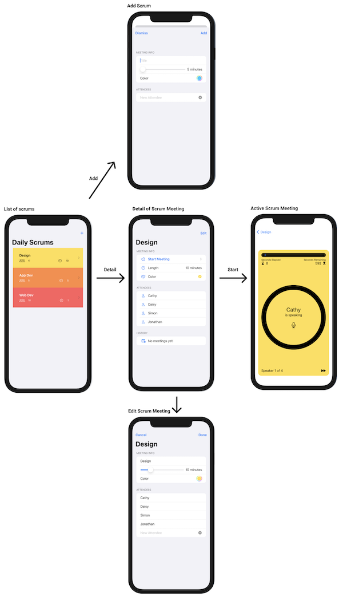
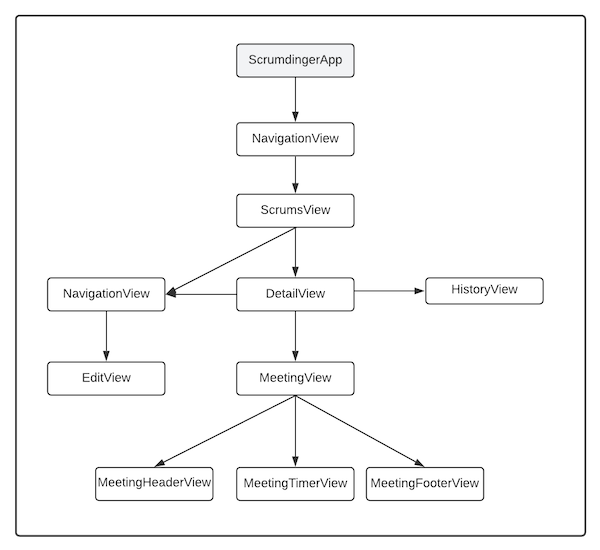

# Overview

This repo contains [Scrumdinger app](https://developer.apple.com/tutorials/app-dev-training/getting-started) from Apple's tutorial, rewritten in uni-directional architecture [Composable Architecture](https://github.com/pointfreeco/swift-composable-architecture).

## Motivation

I created this repo to learn & explore the [Composable Architecture](https://github.com/pointfreeco/swift-composable-architecture) that was made by [Brandon Williams](https://www.twitter.com/mbrandonw) and [Stephen Celis](https://www.twitter.com/stephencelis).

Instead of starting with greenfield Xcode project I decided to pickup the final version of Scrumdinger app, that seemed to me to be just at the right size for this exercise. I walked through the official Apple tutorial prior to starting the project migration to CA.
The familiarity with the Scrumdinger project was a plus.
When it comes down to Composable Architecture, it comes with plenty of examples and case-studies that showcase how to tackle most of the common challenges. This was great resource at the times I felt litlle bit stucked with the migration.

I decided to open-source my findings to help others and me to improve the understanding of the Composable Architecture.

_**Note:**_

This project is in highly experimental/prototyping stage and is not meant for production use.

In terms of functionality/features, this project aims to be 1:1 consistent with the of the Apple's Scrumdinger app, but don't expect me to not break the things along the way :)

## Scrumdinger app

Scrumdinger app gives you possibility to maintain your scrum meetings.
Scrum meetings can be added, edited, started & recorded.

Every scrum meeting has following attributes:
* name
* length
* color
* list of attendees
* history of transcripts from previous meetings

Below you can find the basic user flow of the Scrumdinger app.


## Learnings and Explorations

In this section I'll roughly talk about my approaches that I took when rewriting the Scrumdinger app's vanilla SwiftUI into Composable Architecture.

I won't talk about uni-directional architecture, its pros or cons here. There's already quantum of articles that discuss this topic, and on top of that, I'll rather go straight to the point.

By looking at the app's view hierarchy I naturally started to rewrite the views from the bottom up.

_Note: There are few views/components left untouched, since applying the CA to them wouldn't add much value_


Thanks to SwiftUI previews this gave me the opportunity to iteratively rewrite views & the state management behind them without declaring the World War III against the Swift compiler.

## Migration to TCA

### Simplest case for State, Actions, Environment, Reducer and Store

The pattern that I repeated several times in this project was to actually declare a dedicated `State`, `Actions`, `Environment` and `Reducer` for each view in 1:1 ratio.

How did it look like in the simplest case? Here are few steps that I followed when turning the `MeetingFooterView` into CA.

```swift
struct MeetingFooterView: View {
    let speakers: [ScrumTimer.Speaker]
    private var speakerNumber: Int? { ... }
    private var isLastSpeaker: Bool { ... }
    private var speakerText: String { ... }

    var skipAction: () -> Void
    var body: some View {
       ...
    }
}
```

1. First of all, add `ComposableArchitecture` package to the project.
2. Import CA in the source file `import ComposableArchitecture`.

#### State

Identify all the properties that keep the view's state and move them to standalone `State` struct(or enum) that conforms to `Equatable` protocol.

```  diff
struct MeetingFooterView: View {
-    let speakers: [ScrumTimer.Speaker]
-    private var speakerNumber: Int? { ... }
-    private var isLastSpeaker: Bool { ... }
-    private var speakerText: String { ... }

    var skipAction: () -> Void
    var body: some View {
       ...
    }
}
```

Turn all properties to access level of your store - eg from `private` to `internal`.

``` swift
struct MeetingFooterState: Equatable {
    let speakers: [ScrumTimer.Speaker]
    var speakerNumber: Int? { ... }
    var isLastSpeaker: Bool { ... }
    var speakerText: String { ... }
}
```

_Note: Comment out all the lines of code that don't compile at this moment. You'll uncomment them once you're ready!_

#### Actions

Identify actions in your view and model them via equatable `enum`. Actions doesn't necessarily need to be user-initiated.

```  diff
struct MeetingFooterView: View {
-    var skipAction: () -> Void
    var body: some View {
       ...
    }
}
```
👇
```swift
enum MeetingFooterAction: Equatable {
    case skipSpeaker
}
```

#### Environment

Declare the corresponding `environment` struct if needed. In this case, I skipped the declaration of the environment, as there wasnt need for it.

#### Reducer

Maybe I did something wrong, but I found out that I didn't need to declare `reducer` for this view. With that being said, I didn't need to use `Effects` within this view.

#### Store

Declare and use the `store` in the SwiftUI view.

1. Declare the `store` property, that contains two associated values. Your newly created `MeetingFooterState` and `MeetingFooterAction`.

```  diff
struct MeetingFooterView: View {

+  let store: Store<MeetingFooterState, MeetingFooterAction>

    var body: some View {
       ...
    }
}
```

2. Use `viewStore` in the `body` of your view by calling following API - ```WithViewStore(store) { viewStore in ... }```
```  diff
struct MeetingFooterView: View {

  let store: Store<MeetingFooterState, MeetingFooterAction>

    var body: some View {
+       WithViewStore(store) { viewStore in 
           ...
+       }
    }
}
```

3. Access the `state` through the passed in `viewStore` parameter.
```diff
struct MeetingFooterView: View {

    let store: Store<MeetingFooterState, MeetingFooterAction>

    var body: some View {
        WithViewStore(store) { viewStore in
            VStack {
                HStack {
+                    if viewStore.isLastSpeaker {
                       ...
                    } else {
+                       Text(viewStore.speakerText)
                        ...
                    }
                }
            }
            ...
        }
    }
}
```

4. Send the `action` to the store by using the `viewStore.send(MeetingFooterAction)` API.
```swift
Button(action: { viewStore.send(.skipSpeaker) } )
```

8. Update your preview provider to conform to the new API. Tadaaa
```swift
struct MeetingFooterView_Previews: PreviewProvider {
    static var speakers = ...
    static var previews: some View {
        MeetingFooterView(store: Store<MeetingFooterState, MeetingFooterAction>(initialState: MeetingFooterState(speakers: speakers),
                                                                                reducer: .empty,
                                                                                environment: ()))
            .previewLayout(.sizeThatFits)
    }
}
```

---

### Combining the reducers (TBC..)

---

## Licensing
Please look at [License](https://github.com/bielikb/scrumdinger/blob/main/LICENSE/LICENSE.txt) for more details.
